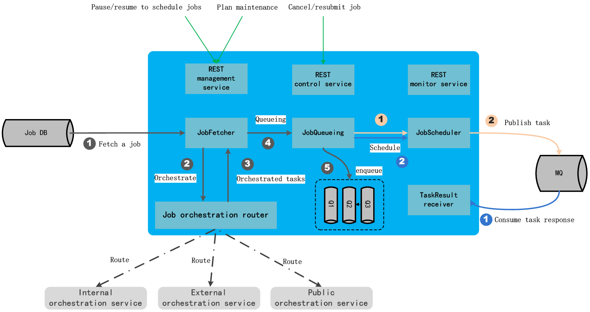

# scheduled
A job scheduling service for managing basic computation resources, updating job/task statuses, deciding when to schedule a task to be executed, and receiving task execution result.

## Architecture

